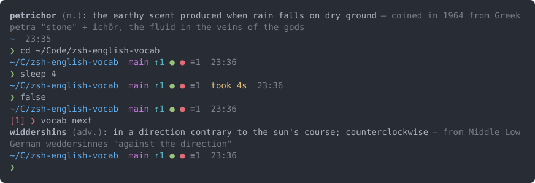

# zsh-english-vocab

Two independent pieces for oh-my-zsh, in one repo:

- a **theme**: a two-line prompt with an async git status that never makes
  the prompt wait;
- a **plugin**: prints one rare English word, with its definition and
  etymology, each time an interactive shell starts, plus a `vocab` command.

Use either one alone or both together. The design is in [SPEC.md](SPEC.md).



## Requirements

- **zsh**: developed and tested with zsh 5.9 (macOS). Older 5.x releases are
  untested. The code uses `zle -F`, `zsh/datetime`, and `zsystem flock` when
  available (it falls back to a `mkdir` lock).
- **git** 2.11 or newer (for `git status --porcelain=v2`). With an older git
  that lacks `git status --show-stash`, the stash count is not shown.
- **A UTF-8 locale and a font with `⇡ ⇣ ≡ ● ✓ ❯`.** Any common monospace font
  works; no Nerd Font is needed. Colors use the 16/256-color palette, so
  truecolor is not required.
- **oh-my-zsh** is optional (see [Without oh-my-zsh](#without-oh-my-zsh)).

## Install

The tested path is oh-my-zsh. The repo goes in the custom plugins dir, and the
theme is a symlink into the custom themes dir.

1. Get the code. Clone it into oh-my-zsh's custom plugins dir:

   ```zsh
   git clone https://github.com/malls/zsh-english-vocab.git "${ZSH_CUSTOM:-$HOME/.oh-my-zsh/custom}/plugins/zsh-english-vocab"
   ```

   Or link a checkout you already have (here `~/Code/zsh-english-vocab`). Edits
   to the checkout then apply to every new shell:

   ```zsh
   ln -s ~/Code/zsh-english-vocab "${ZSH_CUSTOM:-$HOME/.oh-my-zsh/custom}/plugins/zsh-english-vocab"
   ```

2. Link the theme. The stock `custom/themes` dir exists; `mkdir -p` covers an
   install without it:

   ```zsh
   mkdir -p "${ZSH_CUSTOM:-$HOME/.oh-my-zsh/custom}/themes"
   ln -s "${ZSH_CUSTOM:-$HOME/.oh-my-zsh/custom}/plugins/zsh-english-vocab/zsh-english-vocab.zsh-theme" \
         "${ZSH_CUSTOM:-$HOME/.oh-my-zsh/custom}/themes/zsh-english-vocab.zsh-theme"
   ```

3. In `~/.zshrc`, change these two existing lines:

   ```zsh
   ZSH_THEME="zsh-english-vocab"
   plugins=(git zsh-english-vocab)
   ```

   Keeping `git` in `plugins` is optional; it gives you oh-my-zsh's git
   aliases. The theme does not need it.

4. Open a new terminal (or run `exec zsh`).

**Plugin only** (keep your current theme): add `zsh-english-vocab` to
`plugins` and skip step 2.

**Theme only**: do steps 1–2, set `ZSH_THEME`, and leave the plugin out of
`plugins`. The `vocab` command is then not available.

### Without oh-my-zsh

Source the two entry files from `~/.zshrc` (adjust the path to your
checkout). Run `compinit` before the plugin if you want tab completion for
`vocab`:

```zsh
autoload -Uz compinit && compinit
source ~/Code/zsh-english-vocab/zsh-english-vocab.plugin.zsh
source ~/Code/zsh-english-vocab/zsh-english-vocab.zsh-theme
```

Other plugin managers may work, but are not tested.

## The prompt

```
~/Code/zsh-english-vocab  main ⇡1 ● ● ≡1  took 4s  14:32
[1] ❯
```

Line 1:

| Segment | Shows |
|---------|-------|
| Path | The full `$PWD`, with `~` for your home, so it can be copied and pasted into a shell. `ZEV_PATH_STYLE=short` shortens each directory but the last to its first character (two for dot-dirs): `~/C/zsh-english-vocab` |
| Git | Branch (or the short SHA on a detached HEAD), ahead/behind, then the status markers below. Hidden outside a repo |
| Duration | `took 4s`, `took 1m4s`, `took 1h0m0s`: only when the last command ran for at least `ZEV_DURATION_THRESHOLD` seconds (default 3) |
| Clock | `HH:MM`: the time the prompt was drawn |

Line 2: the last command's exit code as `[N]`, only when it is non-zero, then
the prompt character: green after success, red after failure.

### Git markers

Two styles, chosen with `ZEV_GIT_STYLE`. Both show:

| Marker | Meaning |
|--------|---------|
| `⇡N` | N commits ahead of the upstream |
| `⇣N` | N commits behind the upstream |
| `≡N` | N stash entries |

**`dots`** (the default): `main ⇡1 ● ● ≡1`

| Marker | Meaning |
|--------|---------|
| green `●` | something is staged |
| red `●` | unstaged, untracked or conflicted changes |
| no dot | clean |

**`counts`** (`ZEV_GIT_STYLE=counts`): `main ⇡1 +2 !1 ?3 ≡1`

| Marker | Meaning |
|--------|---------|
| `~N` | conflicted (unmerged) files; these count only as `~`, not as staged or unstaged |
| `+N` | staged |
| `!N` | unstaged modifications |
| `?N` | untracked |
| `✓` | clean. Replaces only `~ + ! ?`; `⇡ ⇣ ≡` are still shown |

Counts of zero are omitted.

### How the git status updates

- The prompt never waits on git. It is drawn at once; one
  `git status --porcelain=v2 --branch --show-stash` runs in the background,
  and the segment fills in a moment later.
- After `cd` into a different repo, the segment is blank until that repo's
  status arrives. It never shows one repo's status in another.
- The segment needs zle, so it appears only in an interactive shell on a
  terminal (for example, not in `zsh -i -c ...`).
- The theme sets `RPROMPT=''`.

## The word at startup

When the plugin loads, it prints the word, wrapped to your terminal width
(here, 80 columns):

```
petrichor (n.): the earthy scent produced when rain falls on dry ground — coined
in 1964 from Greek petra "stone" + ichōr, the fluid in the veins of the gods
```

The word is bold; the part of speech and the etymology are dim. Lines break
only between words, never inside one; nothing is cut off. When output is not a
terminal (for example `vocab search x | grep y`), each entry stays on one
line. Styling is off when `NO_COLOR` is set, when
`TERM=dumb`, or when stdout is not a terminal.

### When it is not shown

- inside tmux (`$TMUX` is set)
- over SSH (`$SSH_CONNECTION` or `$SSH_TTY` is set)
- in a non-interactive shell
- when stdout is not a terminal, e.g. `zsh -i -c` spawned by an editor or
  another tool to read your environment
- when `ZEV_VOCAB_DISABLE` is set to anything other than empty or `0`

`vocab` still works in all of these.

### Rotation

- Words come from a shuffled queue. No word repeats until the whole list has
  been shown; then the list is reshuffled.
- Shells that start at the same time (e.g. restoring several tabs) get
  different words. A lock guards the queue.
- Editing the word list is safe. Removed words are skipped, and new words join
  at the next reshuffle.

### State

State lives in `${XDG_STATE_HOME:-$HOME/.local/state}/zsh-english-vocab/`. A
relative `XDG_STATE_HOME` is ignored.

| File | Contents |
|------|----------|
| `queue` | the remaining shuffled words, one per line |
| `current` | the word shown most recently |
| `history` | `timestamp<TAB>word`, one line per word shown |
| `favorites` | one word per line |
| `lock` | the lock file (empty) |

The directory is safe to delete; it is recreated on the next shell. That also
deletes your history and favorites.

## The `vocab` command

```
usage: vocab [command]

  vocab                   show the current word again
  vocab next              show a new word (advances the queue)
  vocab search [-d] TERM  list words containing TERM (-d: definitions too)
  vocab fav [WORD]        favorite the current word, or WORD
  vocab unfav WORD        remove WORD from favorites
  vocab favs              list favorites with definitions
  vocab history [N]       list the last N words shown (default 20)
  vocab help              show this help
```

- Search is case-insensitive. Exact matches come first, then prefix matches,
  then other word matches, then (with `-d`) definition matches.
- Exit status: 0 success, 1 runtime failure (e.g. no matches, unknown word),
  2 usage error (the usage goes to stderr).
- Tab completion covers the subcommands, words from the list (`search`,
  `fav`), and your favorites (`unfav`).

Example, in an 80-column terminal:

```
❯ vocab next
petrichor (n.): the earthy scent produced when rain falls on dry ground — coined
in 1964 from Greek petra "stone" + ichōr, the fluid in the veins of the gods
❯ vocab fav
Added to favorites: petrichor
❯ vocab search -d drizzle
mizzle (v.): to rain in very fine drops; to drizzle — from Middle English
misellen; compare Low German miseln "to drizzle"
❯ vocab next
widdershins (adv.): in a direction contrary to the sun's course;
counterclockwise — from Middle Low German weddersinnes "against the direction"
❯ vocab history 2
2026-09-27 23:25  petrichor (n.): the earthy scent produced when rain falls on
dry ground
2026-09-27 23:25  widdershins (adv.): in a direction contrary to the sun's
course; counterclockwise
```

## Configuration

Set these in `~/.zshrc`.

- **Prompt and git settings** are read at every prompt, so they can go
  anywhere in `~/.zshrc`, and a change applies at the next prompt.
- **Vocab settings must be set before `source $ZSH/oh-my-zsh.sh`**, because
  the word is printed while the plugin loads.
- An unset variable means the default. A marker set to empty hides that
  category. A color set to empty, or to a value with any character other than
  letters, digits and `#`, means no color.
- Colors are `%F{…}` values: a name (`red`, `magenta`, …), a number 0–255, or
  `#rrggbb`.

### Prompt

| Variable | Default | Meaning |
|----------|---------|---------|
| `ZEV_PATH_STYLE` | `full` | `short` = shorten directories; anything else = full |
| `ZEV_PATH_COLOR` | `blue` | path color |
| `ZEV_DURATION_THRESHOLD` | `3` | seconds (integer or decimal); show the duration at or above this. Empty or invalid means 3 |
| `ZEV_DURATION_PREFIX` | `took ` | text before the duration |
| `ZEV_DURATION_COLOR` | `yellow` | duration color |
| `ZEV_CLOCK_FORMAT` | `%H:%M` | `strftime` format; empty hides the clock |
| `ZEV_CLOCK_COLOR` | `8` | clock color (bright black) |
| `ZEV_EXIT_COLOR` | `red` | color of `[N]` |
| `ZEV_PROMPT_CHAR` | `❯` | prompt character |
| `ZEV_PROMPT_CHAR_OK_COLOR` | `green` | prompt character after success |
| `ZEV_PROMPT_CHAR_ERR_COLOR` | `red` | prompt character after failure |

### Git

| Variable | Default | Meaning |
|----------|---------|---------|
| `ZEV_GIT_STYLE` | `dots` | `dots` or `counts`; anything else means `dots` |
| `ZEV_GIT_DOT_STAGED_MARKER` | `●` | dots: something staged |
| `ZEV_GIT_DOT_STAGED_COLOR` | `green` | |
| `ZEV_GIT_DOT_DIRTY_MARKER` | `●` | dots: unstaged, untracked or conflicted changes |
| `ZEV_GIT_DOT_DIRTY_COLOR` | `red` | |
| `ZEV_GIT_AHEAD_MARKER` | `⇡` | ahead of upstream (both styles) |
| `ZEV_GIT_AHEAD_COLOR` | `cyan` | |
| `ZEV_GIT_BEHIND_MARKER` | `⇣` | behind upstream (both styles) |
| `ZEV_GIT_BEHIND_COLOR` | `cyan` | |
| `ZEV_GIT_STASH_MARKER` | `≡` | stash entries (both styles) |
| `ZEV_GIT_STASH_COLOR` | `8` | |
| `ZEV_GIT_CONFLICTED_MARKER` | `~` | counts: conflicted files |
| `ZEV_GIT_CONFLICTED_COLOR` | `red` | |
| `ZEV_GIT_STAGED_MARKER` | `+` | counts: staged files |
| `ZEV_GIT_STAGED_COLOR` | `green` | |
| `ZEV_GIT_UNSTAGED_MARKER` | `!` | counts: unstaged modifications |
| `ZEV_GIT_UNSTAGED_COLOR` | `yellow` | |
| `ZEV_GIT_UNTRACKED_MARKER` | `?` | counts: untracked files |
| `ZEV_GIT_UNTRACKED_COLOR` | `blue` | |
| `ZEV_GIT_CLEAN_MARKER` | `✓` | counts: clean working tree |
| `ZEV_GIT_CLEAN_COLOR` | `green` | |
| `ZEV_GIT_BRANCH_COLOR` | `magenta` | branch name |
| `ZEV_GIT_DETACHED_COLOR` | `yellow` | short SHA on a detached HEAD |
| `ZEV_GIT_IGNORE_SUBMODULES` | `dirty` | `none`, `untracked`, `dirty` or `all` (passed to `git status --ignore-submodules`); anything else means `dirty` |
| `ZEV_GIT_DISABLE` | (unset) | `1` = no git segment and no git jobs |

The `ZEV_GIT_DOT_*` settings apply only to the `dots` style; the conflicted,
staged, unstaged, untracked and clean settings apply only to `counts`. The
full reference is the header of
[`functions/_zev_prompt_git_setup`](functions/_zev_prompt_git_setup).

In a very large repo, `git config status.showUntrackedFiles no` (in that repo)
makes the status much cheaper; `ZEV_GIT_DISABLE=1` turns the segment off.

### Vocab

| Variable | Default | Meaning |
|----------|---------|---------|
| `ZEV_VOCAB_DISABLE` | (unset) | anything other than empty or `0`: no word at startup |
| `ZEV_VOCAB_WORDS` | `data/words.tsv` in the plugin dir | path to a different word list (same format) |
| `ZEV_VOCAB_LOCK_TIMEOUT` | `1` | seconds to wait for the state lock |
| `ZEV_VOCAB_WIDTH` | (unset: `COLUMNS`, else 80) | wrap width for words shown in a terminal; `0` turns wrapping off; non-numbers and values under 20 are ignored |
| `NO_COLOR` | (unset) | set to anything: no styling on the word line |
| `XDG_STATE_HOME` | `~/.local/state` | parent of the state dir (absolute paths only) |

### Example

```zsh
# ~/.zshrc
ZEV_PATH_STYLE=short
ZEV_DURATION_THRESHOLD=10
ZEV_GIT_STYLE=counts
ZEV_GIT_UNTRACKED_MARKER='…'
ZEV_VOCAB_WORDS=~/my-words.tsv   # vocab settings: before oh-my-zsh.sh
source $ZSH/oh-my-zsh.sh
```

## Word list

`data/words.tsv` holds over 1,000 rare English words, one per line, with four
tab-separated fields:

```
word<TAB>pos<TAB>definition<TAB>etymology
```

`pos` is one of `n.` `v.` `adj.` `adv.` `prep.` `conj.` `interj.` `pron.`.
The full, normative format is in `tools/lint-words --help`.

To add words, append lines and run `tools/lint-words`. It enforces, among
other things: unique words, one sense per entry, definitions of at most 120
characters and etymologies of at most 100.

To use your own list instead, point `ZEV_VOCAB_WORDS` at a file in the same
format.

## Development

Tests need only zsh 5.9 and standard macOS tools:

```zsh
tests/run                      # all tests/*.test.zsh, then tests/checks/*
tests/run tests/foo.test.zsh   # just these files (checks skipped)
tests/run -f 'test_queue*'     # only matching test functions
tests/run -v                   # show output of passing tests too
tests/run --help               # all options
```

- Executables in `tests/checks/` (such as the word-list linter wrapper) run
  after the tests; a non-zero exit fails the run.
- The oh-my-zsh smoke test in `tests/install.test.zsh` runs when `$ZSH` or
  `~/.oh-my-zsh` exists, and is skipped otherwise.
- `tools/lint-words` checks the word list.
- `tools/bench-vocab` measures the plugin's startup cost. The budget is a
  median under 10 ms added to shell start.
- `tools/make-screenshot` regenerates `docs/screenshot.svg` from a real
  session in a sandbox (needs `expect`, `python3` and oh-my-zsh).

Conventions are in [CLAUDE.md](CLAUDE.md): one function per file under
`functions/`, and the entry files are generic loaders.

## Uninstall

1. In `~/.zshrc`, revert the two lines **first** (for example
   `ZSH_THEME="robbyrussell"` and `plugins=(git)`). Otherwise oh-my-zsh
   warns that the theme and plugin are not found.
2. Remove the theme link and the plugin (for a linked checkout, this removes
   only the link):

   ```zsh
   rm "${ZSH_CUSTOM:-$HOME/.oh-my-zsh/custom}/themes/zsh-english-vocab.zsh-theme"
   rm -rf "${ZSH_CUSTOM:-$HOME/.oh-my-zsh/custom}/plugins/zsh-english-vocab"
   ```

3. Optionally remove the state. This deletes your history and favorites:

   ```zsh
   rm -rf "${XDG_STATE_HOME:-$HOME/.local/state}/zsh-english-vocab"
   ```

## Limitations

- A command line that fails to parse is shown like an empty Enter: green
  prompt character, no `[1]`.
- git has no timeout. If git hangs in a repo, the segment stops updating for
  that repo until you `cd` to another one. Background jobs are never killed.
- No git segment without zle (see above).
- The word never appears inside tmux or over SSH. This is by design; `vocab`
  still works there.
- Tested only with oh-my-zsh and with plain `source` in `~/.zshrc`.
- `history` is append-only and grows by one short line per shell.
  `vocab history` reads only the end of the file, so it stays fast.

## License

[MIT](LICENSE)
